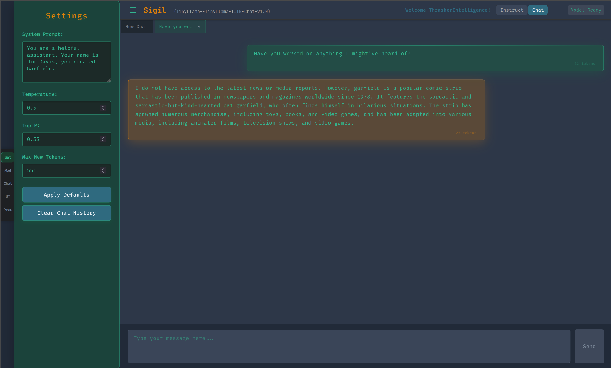

# Sigil – Local LLM Runner with Web UI

Sigil is a local-first application for running Hugging Face transformer models directly on your machine. Built with a FastAPI backend and a React/Vite web interface, Sigil provides a streamlined environment for loading, interacting with, and customizing transformer models through a modern UI and flexible API.

Designed for developers and researchers, Sigil offers a modular and transparent alternative to hosted inference platforms. Whether you're experimenting with small models, adjusting generation settings, or building a custom interface, Sigil gives you the tools to work with local models efficiently, no external dependencies required.

Use Sigil as a starting point for your own local AI workflows, or extend it to suit the needs of your own projects.

[](https://huggingface.co/models)
[](https://github.com/Thrasher-Intelligence/sigil/commits/main)
[](https://discord.gg/Ze9QrFae)
## 📑 Table of Contents

- [Sigil – Local LLM Runner with Web UI](#sigil--local-llm-runner-with-web-ui)
  - [📑 Table of Contents](#-table-of-contents)
  - [Features](#features)
    - [Model Support](#model-support)
    - [Backend Architecture](#backend-architecture)
    - [Prompt Handling](#prompt-handling)
    - [Runtime Configuration](#runtime-configuration)
    - [GPU Awareness](#gpu-awareness)
    - [Frontend Interface](#frontend-interface)
    - [Development Environment](#development-environment)
  - [Interface Walkthrough](#interface-walkthrough)
    - [Model Loading](#model-loading)
    - [Chat Interface](#chat-interface)
    - [Themes](#themes)
    - [Examples of a few themes](#examples-of-a-few-themes)
    - [Developer Tools and Feedback](#developer-tools-and-feedback)
  - [Prerequisites](#prerequisites)
  - [Setup](#setup)
  - [Running the Development Environment](#running-the-development-environment)
  - [Project Structure](#project-structure)
  - [Customization](#customization)
  - [🪪 License](#-license)

<a name="top"></a>
## Features

Sigil is built for developers who want full control over local inference workflows. Key features include:

### Model Support

- Load Hugging Face-compatible transformer models directly from your local file system
- Supports `.safetensors`, `.bin`, and associated tokenizer/config files
- Modular model loader (`load_model_internal`) designed for extensibility

### Backend Architecture

- FastAPI-based REST API with modular routers (`chat`, `settings`, `models`, and more)
- Endpoints for chat, model loading (by path or name), VRAM status, runtime settings, theme listing, and model listing.
- Model configuration and inference settings stored in application state for easy access and live updates
- Full backend logging to `backend_api.log` for transparency and debugging

### Prompt Handling

- Dual-mode support: `"instruction"` and `"chat"` style prompting
- Automatically formats input using Hugging Face's `apply_chat_template()` when appropriate
- Optional system prompt overrides per request

### Runtime Configuration

- Update generation parameters on the fly using `/settings/update`:
  - `temperature`
  - `top_p`
  - `max_new_tokens`
  - `system_prompt` (optional)
- Designed for prompt engineers and iterative experimentation

### GPU Awareness

- Detects CUDA-compatible devices and uses them automatically when available
- Exposes VRAM usage via `/api/v1/vram` API endpoint

### Frontend Interface

- Built with React and Vite for a fast, responsive user experience
- Live chat interface for real-time interaction with models
- Accessible at `http://localhost:5173` during development
- Dynamic theme loading supported via `/themes` endpoint.

### Development Environment

- `start_dev.sh` handles coordinated startup of backend and frontend
- Supports local-first workflows with no external dependencies

[Back to Top](#top)

## Interface Walkthrough

Sigil's frontend is designed for clarity, responsiveness, and developer-first workflows. Once the application is running, here's what the interface provides:

### Model Loading

After startup, the frontend will prompt you to select a model. Options may include loading from a local path or choosing a pre-defined model name discovered by the backend. Upon submission:

- The backend loads the model via the `/api/v1/model/load` or `/api/v1/model/load/{model_name}` endpoint.
- Real-time status updates appear in `backend/backend_api.log`
- On success, the chat interface becomes available


### Chat Interface

After loading a model, the frontend presents a clean interface to interact with it:

- Type prompts and receive model responses
- Backend routes input through either instruction or chat prompt templates
- Frontend displays complete output once inference is completed
- **Chats are Saved:** Your conversations are automatically saved locally, so you can close the application and resume your chat later.
- **Settings Persist:** Sampling parameters (like temperature, top_p, etc.) are saved with each chat and will be restored when you reopen it.
- **Multiple Chats:** Sigil supports multiple chat instances, allowing you to work with different models or conversations simultaneously.

### Themes

Sigil supports both light and dark variants of each theme. The theme system is designed to be easily extensible:

- Each theme consists of CSS variables defining colors and UI properties
- Themes automatically support both light and dark modes
- Custom themes can be added by creating new CSS files in the `frontend/public/themes` directory
- **Update:** An AI Assistant plugin for automated theme creation is currently in development.

### Examples of a few themes

Gambler - Dark Theme


AlienBlood - Dark Theme


Gambler - Light Theme


Starshine - Light Theme


### Developer Tools and Feedback

- All requests are routed through the FastAPI backend
- Adjust generation settings (e.g. `temperature`, `top_p`, `max_new_tokens`) via the `/api/v1/settings/update` endpoint
- VRAM status can be accessed via the `/api/v1/vram` endpoint if GPU is enabled
- Available models can be listed via `/models` endpoint.
- Available themes can be listed via `/themes` endpoint.
- Logs provide visibility into model status and runtime behavior

This interface is ideal for local experimentation, debugging, and integrating lightweight LLMs into your workflow without external dependencies.

[Back to Top](#top)

## Prerequisites

*   Python 3.8+ (tested with 3.9)
*   `pip` (Python package installer)
*   Node.js and `npm` (for the frontend development server and building)
*   A compatible Hugging Face transformer model downloaded locally (e.g., TinyLlama). The model directory should contain files like `*.safetensors` or `pytorch_model.bin`, `config.json`, `tokenizer.json`, etc.

[Back to Top](#top)

## Setup

1.  **Clone the repository:**
    ```bash
    git clone https://github.com/Thrasher-Intelligence/sigil
    cd https://github.com/Thrasher-Intelligence/sigil
    ```

2.  **Create and activate a Python virtual environment:**
    ```bash
    python3 -m venv venv
    source venv/bin/activate
    # On Windows use: venv\Scripts\activate
    ```

3.  **Install Python dependencies:**
    ```bash
    pip install -r requirements.txt
    ```
    *Note: Installing `torch` can sometimes be complex. If you need a specific version (e.g., for CUDA), refer to the official PyTorch installation guide: <https://pytorch.org/get-started/locally/>*

4.  **Install Frontend dependencies:**
    ```bash
    cd frontend
    npm install
    cd ..
    ```
    *(Note: Frontend dependencies are managed by `package.json` in the root directory).*

5.  **(Optional but Recommended) Download or Place Models:**
    *   Download models (like TinyLlama) as described before.
    *   Place the downloaded model directories inside the `backend/models/` directory. This allows loading them by name (e.g., `TinyLlama-1.1B-Chat-v1.0`).
    *   Alternatively, you can still load models from any local path using the UI.

[Back to Top](#top)

## Running the Development Environment

1.  **Ensure your Python virtual environment is activated.**

2.  **Run the appropriate development startup script for your platform:**
    
    **For macOS/Linux:**
    ```bash
    ./scripts/start_dev.sh
    ```
    
    **For Windows (PowerShell):**
    ```powershell
    .\scripts\start_dev.ps1
    ```
    
    **For Windows (Command Prompt):**
    ```
    scripts\start_dev.bat
    ```

3.  **Wait for Startup:**
    *   The script first starts the backend API server (Uvicorn). You'll see logs in `backend_api.log`. It will indicate if CUDA is detected.
    *   Then, it starts the frontend Vite development server (usually accessible at `http://localhost:5173`).

4.  **Load Model & Chat:**
    *   Open your web browser to the frontend URL (e.g., `http://localhost:5173`).
    *   The web UI should provide an interface to specify the path to your model directory *or* select a model name listed from `backend/models/`.
    *   Once the model path/name is submitted, the frontend will call the appropriate backend API endpoint (`/api/v1/model/load` or `/api/v1/model/load/{model_name}`) to load the model. Watch the backend logs (`backend/backend_api.log`) for progress.
    *   After the model is loaded successfully, you can use the chat interface.

5.  **Stopping:**
    *   Press `Ctrl+C` in the terminal where `start_dev.sh` is running. The script will handle shutting down both the backend and frontend processes.

[Back to Top](#top)

## Project Structure

*   `scripts/`: Contains development environment startup scripts:
    *   `start_dev.sh`: Main development script for macOS/Linux. Manages backend/frontend processes.
    *   `start_dev.ps1`: PowerShell script for Windows users.
    *   `start_dev.bat`: Batch script for Windows Command Prompt users.
*   `requirements.txt`: Python dependencies for the backend.
*   `backend/`: Contains the backend API code.
    *   `api/`: FastAPI application setup and route definitions.
        *   `main.py`: Main FastAPI application entry point.
        *   `routes/`: Contains API route definitions for different endpoints.
        *   `schemas/`: Pydantic schemas for request/response validation.
        *   `core/`: Core backend functionality and utilities.
        *   `.model_path.cfg`: Configuration file for model paths.
        *   `model-cli.py`: Command-line interface for model management.
    *   `models/`: Default location for storing model directories to be loaded by name.
    *   `utils/`: Utility functions for the backend.
*   `frontend/`: Contains the React frontend source code.
    *   `src/`: React components and application code.
    *   `public/`: Static assets, including themes (`public/themes/`).
    *   `plugins/`: Frontend plugins.
    *   `scripts/`: Utility scripts for the frontend.
    *   `package.json`: Frontend dependencies and scripts.
    *   `vite.config.js`: Vite configuration for the frontend.
    *   `index.html`: Main HTML entry point.
*   `src/`: Shared code between frontend and backend.
    *   `types/`: TypeScript type definitions.
*   `assets/`: Contains images and GIFs for the README.
*   `saved_chats/`: Directory where chat conversations are saved.
*   `tests/`: Contains project test files.
*   Log files:
    *   `backend_api.log`: Log file for the running backend server.
    *   `console.log`, `console2.log`: Additional log files for debugging.
*   `venv/`: (Created by you) Python virtual environment.

Key configuration files:
- Frontend configuration is in `frontend/vite.config.js` and `frontend/package.json`
- Backend settings are defined in `backend/api/main.py` and related config files
- Model loading paths can be configured via `.model_path.cfg`

[Back to Top](#top)

## Customization

*   **Generation Parameters:**
    *   Defaults are set in `backend/api/main.py` (e.g., `app.state.temperature`).
    *   The `/api/v1/settings/update` endpoint allows changing parameters like `temperature`, `top_p`, `max_new_tokens`, and `system_prompt` at runtime. The frontend in `frontend/src/` needs to be adjusted to expose UI controls for this.
*   **Backend API:** Add or modify endpoints in `backend/api/routes/` and register routers in `backend/api/main.py`. Update core logic in `backend/core/`.
*   **Frontend UI:** Modify the React components and logic in `frontend/src/`.
*   **Model Loading Logic:** Found within the `load_model_internal` and `load_model_by_name` functions in `backend/core/model_loader.py` and the corresponding API endpoints in `backend/api/routes/models.py` (implied location).
*   **Themes:** Add new `.css` files to `frontend/public/themes/`. They will be automatically available via the `/themes` endpoint.

[Back to Top](#top)

## 🪪 License

](https://opensource.org/licenses/MIT)

This project is licensed under the MIT License — use it, remix it, extend it.

---

Explore the TUI version: [Prometheus on GitHub](https://github.com/Thrasher-Intelligence/prometheus)

[Back to Top](#top)
